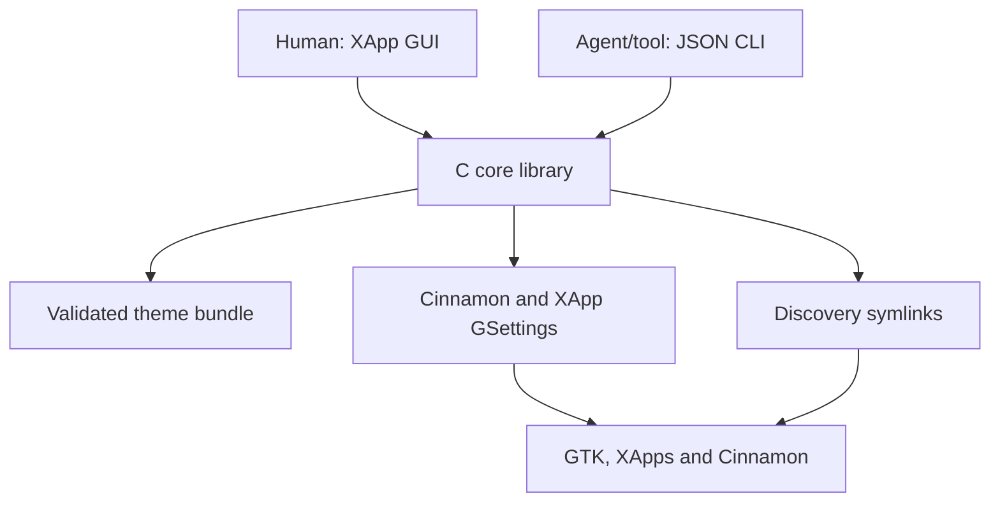
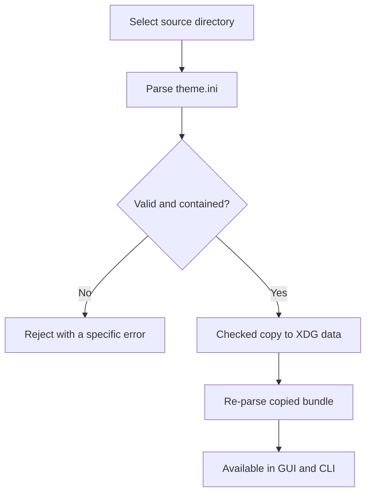
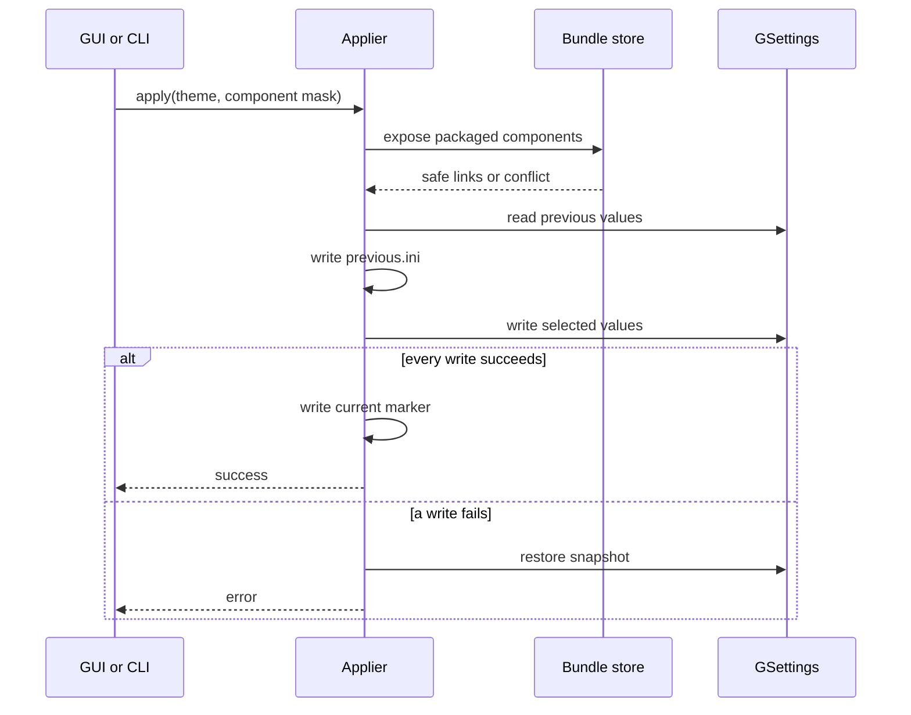
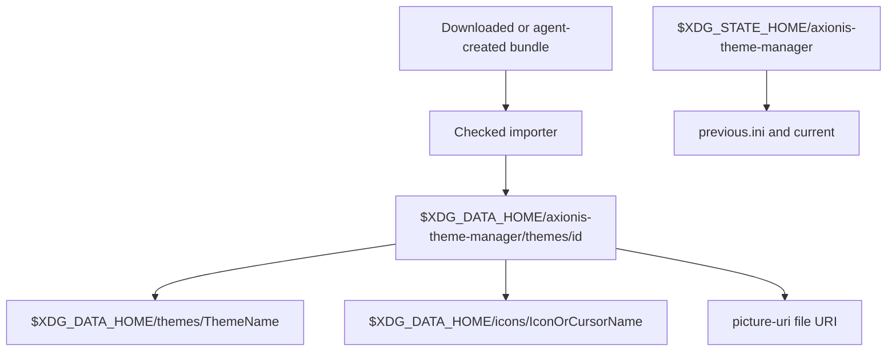

# Axionis Theme Manager Code Overview

This document maps the implementation, the desktop contracts it consumes, and
the locations touched during import/apply. It is intended to make changes easy
to review without first reading every C source file.

## System map

The GUI and CLI share the same parser, validator, store and applier. There is no
second implementation and no shell-command layer.

## Source tree

| Path | Responsibility |
|---|---|
| `src/atm-theme.[ch]` | Parse `theme.ini`, enforce schema 1, validate paths/assets, serialize theme JSON |
| `src/atm-components.[ch]` | Stable numbered map and selector parser |
| `src/atm-store.[ch]` | Discover bundles, import with limits, expose asset directories safely |
| `src/atm-applier.[ch]` | Snapshot, apply, rollback and restore through typed GSettings |
| `src/atm-window.[ch]` | GTK 3/XApp preferences window, preview, import/apply/restore actions |
| `src/atm-cli.c` | Agent-friendly list/map/validate/apply/restore interface |
| `src/main.c` | `GtkApplication` entry point |
| `data/` | Desktop entry, AppStream metadata and application icon |
| `themes/` | Axionis-installed reference bundles |
| `tests/` | Isolated GSettings schemas, fixtures and GLib unit tests |

## Bundle lifecycle

Validation happens both before and after copying. The copy walk rejects links,
special files, executable content and resource-limit violations. If any step
fails, the incomplete destination is removed.

## Apply transaction

GSettings policy locks are checked before each write. An application already
running may keep its old GTK resources until restarted; this is normal GTK
behavior, not a failed transaction.

## Storage and discovery map

The symlinks are created only when the destination does not exist, or already
points to that exact source. The manager refuses to replace a user's existing
theme, icon directory or unrelated link.

System-provided bundles are searched below
`$prefix/share/axionis-theme-manager/themes`. A user bundle with the same ID
takes precedence, matching XDG data-directory precedence.

## Settings map

| Component | Schema | Key | Value source |
|---:|---|---|---|
| 1 | `org.cinnamon.desktop.background` | `picture-uri` | Bundle wallpaper converted to a `file:` URI |
| 2 | `org.cinnamon.theme` | `name` | `CinnamonTheme` |
| 3 | `org.cinnamon.desktop.interface` | `gtk-theme` | `GtkTheme` |
| 4 | `org.cinnamon.desktop.interface` | `icon-theme` | `IconTheme` |
| 5.1 | `org.cinnamon.desktop.interface` | `cursor-theme` | `CursorTheme` |
| 5.2 | `org.cinnamon.desktop.interface` | `cursor-size` | `CursorSize` |
| 6 | no separate key | n/a | `.csstage` rules from active GTK provider |
| 7.1 | `org.x.apps.portal` | `color-scheme` | `ColorScheme` |
| 7.2 | `org.x.apps.portal` | `accent-rgb` | `AccentRGB` |

The applier verifies that every required schema/key exists and is writable.
This intentionally targets Axionis/Cinnamon rather than hiding platform
differences behind a generic abstraction.

A complete apply records the bundle as current. A partial `--only` apply clears
that label because the result is a deliberate mixed composition; undo still
restores the exact previous values and current-theme label.

## Why component 6 is tied to component 3

Cinnamon Screensaver retrieves the active named GTK theme provider and searches
its final stylesheet for `.csstage`. It loads its fallback CSS only when those
selectors are absent. Consequently there is no truthful independent “lock
theme” switch: component 6 is an authoring map inside the GTK theme and is
activated when component 3 is applied.

## Failure boundaries

| Failure | Result |
|---|---|
| Invalid manifest or escaping path | Bundle is not loaded/imported |
| Executable, symlink or special imported content | Import is rejected |
| Name collision in standard theme/icon directories | Apply stops; existing content is preserved |
| Missing/locked Cinnamon schema key | Apply stops with the exact schema/key error |
| GSettings write failure after snapshot | Previous settings are restored |
| Missing undo snapshot | Restore returns a specific non-destructive error |

## Test architecture

`tests/org.axionis.test.gschema.xml` supplies isolated schemas and Meson runs the
test executable with the in-memory GSettings backend. Tests cover valid parsing,
path traversal rejection, stable selector behavior, discovery, executable
content rejection, complete apply, and undo. CI also builds the Debian package
so installed paths and declared dependencies are exercised.

## Adding a component in a later schema

1. Allocate a new top-level number; never renumber schema-1 entries.
2. Add a manifest key and parser/validator field in `atm-theme`.
3. Add the numbered/JSON entry in `atm-components`.
4. Add snapshot, apply and restore behavior in `atm-applier`.
5. Update the GUI summary, `THEME_FORMAT.md`, settings table and fixtures.
6. Add failure-path and round-trip tests before changing the bundle schema.
